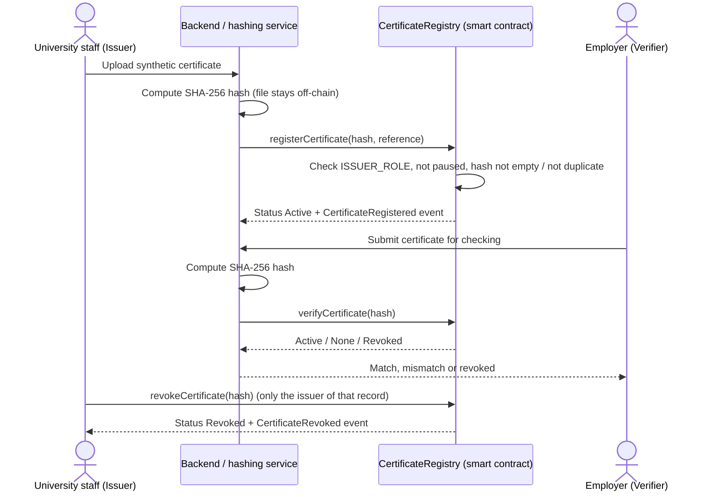

# Main use case (paste the code block into https://mermaid.live, export PNG/SVG for Figure 1)

```mermaid
sequenceDiagram
    actor Uni as University staff (Issuer)
    participant BE as Backend / hashing service
    participant SC as CertificateRegistry (smart contract)
    actor Emp as Employer (Verifier)

    Uni->>BE: Upload synthetic certificate
    BE->>BE: Compute SHA-256 hash (file stays off-chain)
    BE->>SC: registerCertificate(hash, reference)
    SC->>SC: Check ISSUER_ROLE, not paused, hash not empty / not duplicate
    SC-->>BE: Status Active + CertificateRegistered event
    Emp->>BE: Submit certificate for checking
    BE->>BE: Compute SHA-256 hash
    BE->>SC: verifyCertificate(hash)
    SC-->>BE: Active / None / Revoked
    BE-->>Emp: Match, mismatch or revoked
    Uni->>SC: revokeCertificate(hash) (only the issuer of that record)
    SC-->>Uni: Status Revoked + CertificateRevoked event
```
